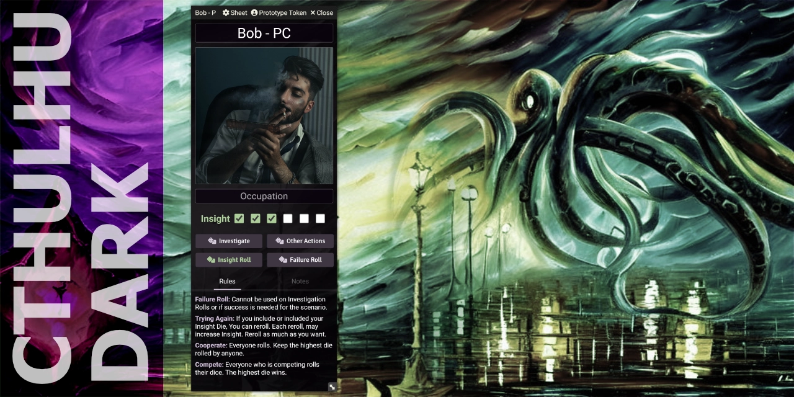
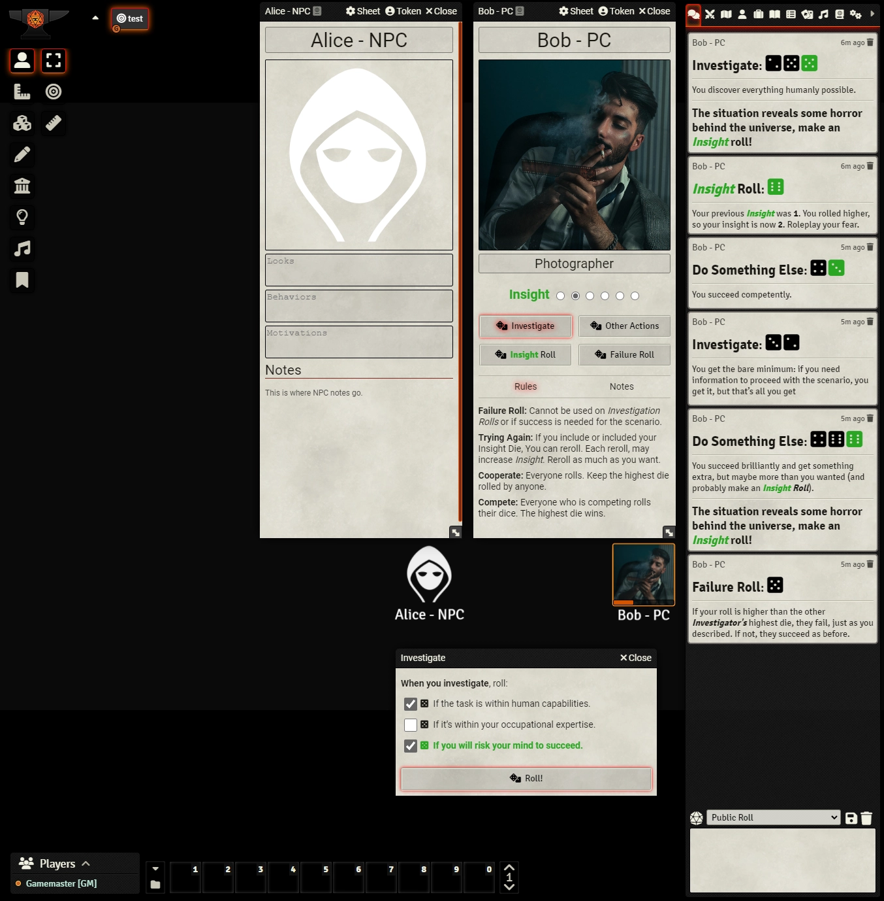

# Cthulhu Dark (Unofficial) System

An unofficial, community-supported system for playing the Cthulhu Dark TTRPG (Created by Graham Walmsley) on Foundry VTT.

- The original free rules from the author: http://catchyourhare.com/files/Cthulhu%20Dark.pdf
- A pay for version of the original Rules: https://www.drivethrurpg.com/product/98137/Cthulhu-Dark-Free-twopage-edition
- Newest updated rules: https://www.drivethrurpg.com/product/341997/Cthulhu-Dark

Image of the Charater Sheet and roll messages in Foundry's chat:

## Features

- Simple Character Sheet
  - Name, Image, Occupation, Insight tracker
  - Buttons to roll Investigate, Do Something Else, Insight Roll, Failure Roll
  - A Rules section summarizing a few rules snippets
  - A Notes section
  - Dark UI design
- Clicking on the roll buttons on the character sheet creates dialogs to choose which die to roll
- The Insight roll automatically increases your insight when appropriate
- All rolls print appropriate outputs into the chat
- Tokens show Insight state at the bottom

## To Be Done

- Automatically roll insight and apply any updates when a roll calls for it

## How to Install

You can install the latest released version of the system by using this manifest link in Foundry VTT. [Instructions](https://foundryvtt.com/article/tutorial/): https://github.com/philote/FoundryVTT-CthulhuDark/releases/latest/download/system.json
