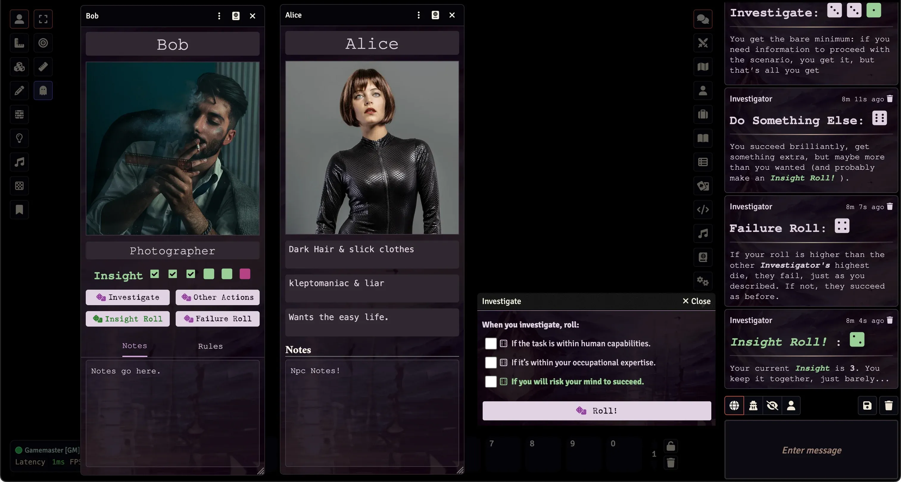

# Cthulhu Dark (Unofficial) System

An unofficial, community-supported system for playing the Cthulhu Dark TTRPG (Created by Graham Walmsley) on Foundry VTT.

    
    
     
     
    
     

     
     
     
    

   	

- The original free rules from the author: http://catchyourhare.com/files/Cthulhu%20Dark.pdf
- A pay for version of the original Rules: https://www.drivethrurpg.com/product/98137/Cthulhu-Dark-Free-twopage-edition
- Newest updated rules: https://www.drivethrurpg.com/product/341997/Cthulhu-Dark

If you’ve enjoyed my work and find value in what I create, please consider supporting me with a small donation on [Ko-fi](https://ko-fi.com/G2G3I91JQ). I truly love what I do, and your support helps me dedicate time and resources to ongoing development. Every contribution, no matter the size, makes a difference and allows me to continue doing what I’m passionate about. Thank you for considering—it means the world to me.

Image of the Character Sheet and roll messages in Foundry's chat:

> [!WARNING]
> ### Cthulhu Dark V2.0+
> **ONLY** works with Foundry v12+\
> If you use Foundry v10 or v11 then use Cthulhu Dark [v1.2.1](https://github.com/philote/cthulhudark/releases/tag/1.2.1)

## Features

- Simple Character Sheet
  - Name, Image, Occupation, Insight tracker
  - Buttons to roll Investigate, Do Something Else, Insight Roll, Failure Roll
  - A Rules section summarizing a few rules snippets
  - A Notes section
  - Dark UI design
- Clicking on the roll buttons on the character sheet creates dialogs to choose which die to roll
- The Insight roll automatically increases your insight when appropriate
- All rolls print appropriate outputs into the chat
- Tokens show Insight state at the bottom
- French translation added by Dispositif https://github.com/Dispositif
- Brazilian Portuguese translation added by Igor Teuri https://github.com/igorteuri
- Spanish translation added by WarriorAmhar https://github.com/WarriorAmhar
- Dice so Nice support by friendlylambda https://github.com/friendlylambda

## To Be Done

- Automatically roll insight and apply any updates when a roll calls for it
- fix items

## How to Install

You can install the latest released version of the system by using this manifest link in Foundry VTT. [Instructions](https://foundryvtt.com/article/tutorial/): https://github.com/philote/FoundryVTT-CthulhuDark/releases/latest/download/system.json

## Attribution

The entire text of Cthulhu Dark is © [Graham Walmsley](http://catchyourhare.com) 2010

Icons from [game-icons.net](http://game-icons.net) are released under a Creative Commons Attribution 3.0 Unported license. https://creativecommons.org/licenses/by/3.0
